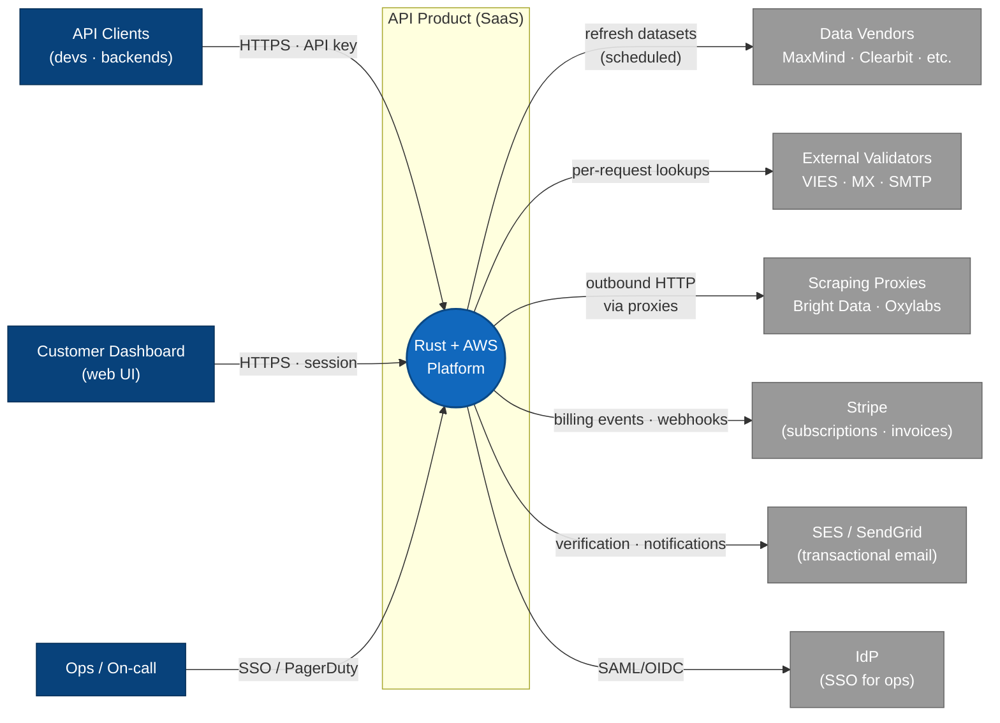
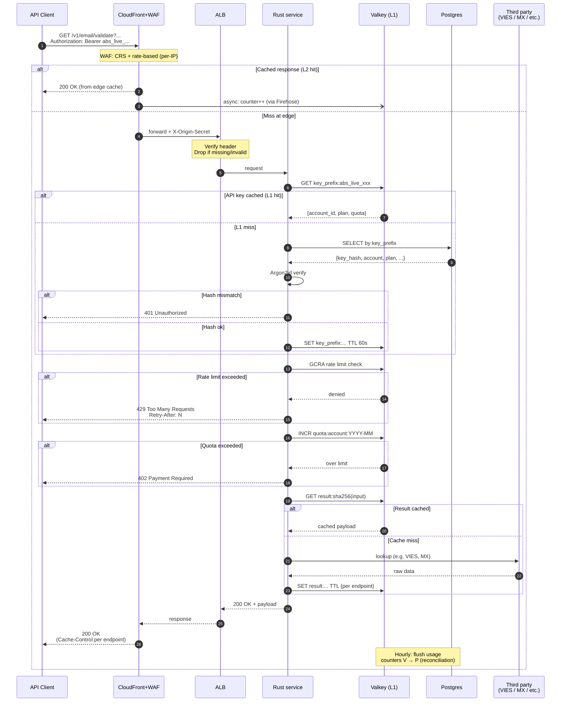

# Arquitectura Rust + AWS para SaaS de APIs como producto

Diseño cost-benefit para un SaaS estilo "APIs como producto" (catálogo de lookups, validators y transforms tipo IP Geolocation, Email Validation, Website Screenshot, etc.), construido en **Rust** sobre **AWS**, con foco en **seguridad**, **multi-AZ** y **caching agresivo**.

Este documento es el resultado del diseño iterativo registrado en `api-stacks-comparison.md`.

---

## 1. Contexto y supuestos

**Modelo de negocio**: API-as-a-product. Clientes (devs/backends) consumen endpoints autenticados con API key y se facturan por request consumido. Cada hit de caché servido al cliente es margen directo; cada miss potencialmente incurre en compute + llamada a tercero pago.

**Tres familias de endpoints** con perfiles muy distintos:

| Familia | Ejemplos | Perfil |
|---|---|---|
| **Lookups** | IP Intel, Geo, Company, FX, Time/Date, Holidays | Read-heavy, cacheable, bounded input space |
| **Validators** | Email, Phone, VAT, IBAN | Mix de cómputo puro + lookups externos (VIES, MX, SMTP) |
| **Transforms** | Screenshot, Image Processing, Web Scraping, Avatars | CPU/IO intensivos, outputs grandes, third-party proxies |

**Perfil de tráfico target**:
- Baseline: 50–200 RPS sostenido.
- Picos: 1–2k RPS.
- SLO: p99 < 200 ms en lecturas, p99 < 500 ms en escrituras (transforms hasta 5 s).
- Disponibilidad objetivo: 99.95% (~22 min/mes de downtime tolerado).

**Prioridades**:
1. Seguridad (defense in depth, mínima superficie pública, secretos nunca en tránsito por IGW).
2. Buen ratio costo/beneficio (sin multi-region activo-activo; sin sobre-ingeniería).
3. Palancas claras para escalar cuando el producto crezca.

**Decisiones fuera de alcance de este documento** (decidirlas aparte):
- Elección de proveedores de datos de referencia (MaxMind, company enrichment, etc.).
- Proveedor de proxies para scraping (Bright Data, Oxylabs).
- SaaS de error tracking (Sentry u otros).
- Proveedor de compliance auditing (SOC 2, ISO 27001).

---

## 2. Arquitectura de alto nivel

Tres vistas complementarias, a distinto nivel de abstracción ([C4 model](https://c4model.com/)):

### 2.1 Contexto del sistema (C4 L1)

Quién consume el producto y con qué terceros habla.



### 2.2 Contenedores (C4 L2) — topología AWS

Versión renderizada con íconos AWS oficiales en [`diagrams/architecture_main.png`](./diagrams/architecture_main.png) (fuente: [`diagrams/architecture.py`](./diagrams/architecture.py)). Versión ASCII para lectura offline:

```
                           Internet
                              │
                              ▼
                       ┌─────────────┐
                       │ CloudFront  │  ← ACM TLS 1.3, HSTS
                       │  + AWS WAF  │  ← Managed CRS + rate-based + geo
                       │  + Shield   │  ← Inyecta X-Origin-Secret rotado
                       └──────┬──────┘
                              │ HTTPS + header secreto
                              ▼
          ┌───────────────── VPC 10.0.0.0/16 ─────────────────┐
          │                                                   │
          │   AZ-a          AZ-b          AZ-c                │
          │   ┌────┐        ┌────┐        ┌────┐              │
          │   │ALB │◄──────►│ALB │◄──────►│ALB │  (subnets    │
          │   │SG: │        │    │        │    │   públicas)  │
          │   │CF  │        │    │        │    │              │
          │   │only│        │    │        │    │              │
          │   └─┬──┘        └─┬──┘        └─┬──┘              │
          │     │             │             │                 │
          │     ▼             ▼             ▼                 │
          │  ┌──────┐      ┌──────┐      ┌──────┐             │
          │  │NAT GW│      │NAT GW│      │NAT GW│             │
          │  └──────┘      └──────┘      └──────┘             │
          │     │             │             │                 │
          │  ┌──┴───┐      ┌──┴───┐      ┌──┴───┐             │
          │  │Fargate│     │Fargate│     │Fargate│  (subnets  │
          │  │ Rust  │     │ Rust  │     │ Rust  │  privadas- │
          │  │lookup│      │lookup│      │lookup│   app)      │
          │  │+trans│      │+trans│      │+trans│             │
          │  └──┬───┘      └──┬───┘      └──┬───┘             │
          │     │             │             │                 │
          │     └─────────────┼─────────────┘                 │
          │                   │                               │
          │                   ▼                               │
          │       ┌─────────────────────┐  (subnets privadas- │
          │       │ RDS Postgres Multi-AZ│  data, sin ruta    │
          │       │  (m7g.large + standby)│  a internet)       │
          │       │ ElastiCache Valkey   │                    │
          │       │  Multi-AZ            │                    │
          │       └─────────────────────┘                    │
          │                                                   │
          │  VPC Endpoints (PrivateLink):                     │
          │   • S3 Gateway (free)        → ECR image layers   │
          │   • DynamoDB Gateway (free)                       │
          │   • ECR API + ECR DKR        → docker pull        │
          │   • CloudWatch Logs          → telemetría         │
          │   • Secrets Manager          → credenciales       │
          └───────────────────────────────────────────────────┘
                              │
                              ▼
                     ┌────────────────┐
                     │   S3 buckets   │  • Reference datasets (MaxMind)
                     │                │  • Transform outputs (screenshots)
                     │                │  • Logs archive (Glacier)
                     │                │  • Backups cross-region
                     └────────────────┘
```

---

## 3. Capa por capa

### 3.1 Compute — ECS Fargate ARM64 (Graviton)

**Decisión**: ECS Fargate sobre Graviton (ARM64), con mix Fargate Spot + on-demand.

**Rationale**:
- Rust compila nativo a `aarch64-unknown-linux-musl`, binario estático.
- Graviton da ~20% mejor precio/performance que x86 Fargate.
- Evita overhead operativo de EKS a este tamaño (<50 servicios).
- Descarta Lambda por baseline sostenido y fricción con pool de conexiones Postgres.

**Configuración**:
- **Imagen runtime**: `gcr.io/distroless/static-debian12:nonroot`. Final size ~15–25 MB.
- **Task size baseline**: 0.5 vCPU / 1 GB para servicios de lookups y validators.
- **Task size transforms**: 2 vCPU / 4 GB (headless Chrome incluido).
- **Capacidad**: 60% Fargate Spot + 40% on-demand en baseline. On-demand puro para picos y transforms.
- **Autoscaling**: target-tracking CPU 60% + métrica secundaria `ALBRequestCountPerTarget`. Min 3 tasks (uno por AZ), max ~2× pico esperado.
- **Flags de compilación**: `RUSTFLAGS="-C target-cpu=neoverse-n1"`, `lto = "thin"`, `strip = true`.

**Split de servicios** — dos servicios ECS separados:

1. **`api-lightweight`**: lookups + validators. Tasks chicos, alta densidad, Spot-heavy.
2. **`api-transforms`**: screenshots, image processing, scraping. Tasks grandes, on-demand, con tolerancia a cold start alto para spawn de Chromium.

### 3.2 Data plane — RDS Postgres Multi-AZ

**Decisión**: RDS Postgres `db.m7g.large` Multi-AZ con Graviton.

**Rationale**:
- Perfil A no justifica Aurora todavía (brilla con storage >500 GB o múltiples réplicas).
- Ecosistema `sqlx` + `sea-orm` en Rust con type-checking de queries en compile time.
- Graviton ~20% más barato para mismo perfil.

**Configuración**:
- Instancia: `db.m7g.large` (2 vCPU, 8 GB). Subir a `db.r7g.large` si el perfil resulta read-heavy con working set grande.
- Storage: **gp3** 100 GB, 3000 IOPS baseline.
- Multi-AZ: standby síncrono en otra AZ. Failover automático en 60–120s.
- Read replicas: **0 al arranque**. Agregar una cuando primary CPU pase 60% sostenido.
- Backup: automated 14 días retention + PITR. Snapshots copiados a región de DR.
- Connection pooling: in-app con `sqlx` (pool de 20–30 por task). **No RDS Proxy** a este tamaño.
- Encryption: KMS con **customer-managed key (CMK)**, multi-region para DR.
- Parameter group custom: `log_min_duration_statement=500ms`, `pg_stat_statements` habilitado.

**Rol de Postgres en la arquitectura**: **sólo control plane** — cuentas, API keys (hashed), planes, usage counters (flush desde Valkey), billing events. NO es store para datasets de referencia.

### 3.3 Datasets de referencia

- **MaxMind GeoIP**, company DB: S3 bucket dedicado, descarga al startup del task y mmap en memoria.
- **tzdata, holidays**: bundleados en el binario Rust con `include_bytes!`.
- **Refresh**: job EventBridge + Fargate task scheduled que descarga del vendor, valida, sube a S3. Tasks lo detectan en próximo rolling deploy.

### 3.4 Caché — 4 niveles

**L0: In-process (por task Rust)**
- Crate `moka` (async, lock-free LRU con TTL).
- 10–50k entradas por task, TTL 60s para hot keys.
- Latencia <1 µs, sin red.

**L1: ElastiCache Valkey Multi-AZ**
- `cache.t4g.small` (1.37 GB), primary + replica en otra AZ.
- Engine **Valkey** (no Redis OSS) — ~20% más barato en ElastiCache.
- Uso:
  - Cache compartido entre tasks (respuestas, cache negativo).
  - Rate limit con GCRA (scripts Lua atómicos).
  - Quotas mensuales (INCR, flush a Postgres cada 60s).
  - Idempotency keys para endpoints de transforms.
- Cluster mode: **OFF** hasta >100k ops/s o >25 GB data.

**L2: CloudFront**
- Delante de ALB para GET endpoints cacheables (IP Geo, Timezones, Holidays, Exchange Rates, format validators).
- Cache key: query params + hash de API key cuando aplica.
- TTLs: 24h (holidays, tz), 1h (IP Geo), 60s (FX rates).
- Hit rate esperado: 60–80% en endpoints públicos.

**L3: S3 + CloudFront (para transforms)**
- Outputs grandes (screenshots, imágenes procesadas) content-addressed: `key = sha256(url + params)`.
- CloudFront delante con TTL 7–30 días.
- Lifecycle: a S3 IA a los 30 días, expirar a 90.

### 3.5 Ingress y seguridad perimetral

**CloudFront** como único entry point público:
- ACM cert, TLS 1.3 mínimo, cipher policy `TLSv1.2_2021`.
- Security headers via CF Functions (HSTS, X-Content-Type-Options, Referrer-Policy).
- Inyecta `X-Origin-Secret` desde Secrets Manager, rotado semanalmente.

**AWS WAF** en CloudFront:
- Managed: Core Rule Set, Known Bad Inputs, Amazon IP Reputation.
- Rate-based: 2000 requests/5min por IP.
- Rate-based por API key (label match en header `Authorization`).
- Custom: bloquear ausencia de header de API key.
- Geo-block de regiones sin clientes.
- Bot Control en modo `count` inicialmente.

**ALB**:
- En subnets públicas.
- SG allow-in sólo desde managed prefix list `com.amazonaws.global.cloudfront.origin-facing`.
- Listener rule valida `X-Origin-Secret` (rechaza si falta o no matchea).
- TLS entre CloudFront y ALB (no HTTP).

**Defense in depth perimetral**: dos muros independientes al origin — SG prefix list + header secreto.

### 3.6 Autenticación por API key

**Formato**: `abs_live_<32 chars random>` y `abs_test_<32 chars>`.

**Storage en Postgres**:
- Nunca plaintext. Hash con **Argon2id** (m=64MB, t=3, p=4) + pepper global en Secrets Manager.
- Fila: `id, account_id, key_prefix, key_hash, created_at, last_used_at, revoked_at, scopes[]`.
- Índice sobre `key_prefix` para lookup rápido antes de verify.

**Validación hot path**:
1. Extraer prefix del header `Authorization: Bearer abs_live_xxx`.
2. Lookup Valkey `key_prefix:<prefix>` → hit: `{account_id, plan, quota}`.
3. Miss: lookup Postgres, verify Argon2id, cargar a Valkey con TTL 60s.
4. Response 401 + métrica de brute-force si no matchea.

**Key lifecycle**: 2 keys activas por cuenta, grace period 30 días al rotar. Scopes opcionales desde el día 1.

**Rate limit y quotas**:
- **Rate limit** (burst): Valkey + GCRA. Respuesta 429 con `Retry-After`.
- **Quota** (mensual): INCR en Valkey, flush a Postgres cada 60s, exceso → 402 + evento billing.

**Billing-accurate counting con caché**:
- CloudFront real-time logs → Kinesis Firehose → Lambda → contador en Valkey.
- Reconciliación horaria con Postgres.
- Alertas si drift > 1%.

**Flujo end-to-end** (hot path de una request autenticada, incluye rutas alternativas):



### 3.7 Red (VPC)

**Topología**: VPC `10.0.0.0/16`, **3 AZs**, 3 capas de subnets por AZ:

| Subnet | Propósito | Ruta default |
|---|---|---|
| Public | ALB, NAT Gateway | IGW |
| Private-app | Fargate tasks | NAT Gateway (AZ-local) |
| Private-data | RDS, Valkey | **Sin ruta a internet** |

**NAT Gateways**: **3, uno por AZ**. AZ-local routing evita cross-AZ charges ($0.01/GB) y tolera caída de cualquier AZ.

**VPC Endpoints**:
- Gateway (gratis, obligatorios): **S3**, **DynamoDB**.
- Interface (PrivateLink, 3 AZs cada uno): **ECR API**, **ECR DKR**, **CloudWatch Logs**, **Secrets Manager**.
- Policies restrictivas en cada endpoint (por ARNs del account, no wildcards).

**Security Groups**: allow-lists estrictas, ningún `0.0.0.0/0` inbound salvo ALB.

**Filtrado de egress**:
- **Route 53 Resolver DNS Firewall** con managed list de AWS (malware, crypto-mining). ~$5/mes.
- **VPC Flow Logs** a S3, 30 días retention.
- **GuardDuty** activo para anomalías de tráfico.

### 3.8 DR y continuidad

**Estrategia**: single region (`us-east-1`) + multi-AZ fuerte + cross-region backups + runbook ejercitado.

**Targets**:
- RTO: 4 horas (redeploy completo en región DR con IaC).
- RPO: 1 hora.

**Componentes**:
- **RDS**: automated backups 14 días, snapshots copiados a `us-west-2`. KMS multi-region key.
- **Valkey**: no se respalda (regenerable). Plan de calentamiento post-DR: escalar 2× Fargate durante 5–15 min.
- **S3**: versioning + MFA delete en buckets críticos. CRR a DR en reference datasets y logs de auditoría.
- **ECR**: registry replication habilitada.
- **Secrets Manager**: replication cross-region en secretos de prod.
- **IaC**: Terraform con state en S3 + DynamoDB lock. Variable de región. Objetivo: bring-up completo <2h.

**Ejercicio trimestral** de DR obligatorio. Sin ejercicios documentados, no hay DR.

### 3.9 Deploy y CI/CD

**Build**:
- Dockerfile multi-stage con `cargo-chef` para caching de dependencias.
- Target `aarch64-unknown-linux-musl`, runtime `distroless/static-debian12:nonroot`.
- sccache con backend S3 + BuildKit cache mounts.

**CI — GitHub Actions con OIDC** (sin credenciales estáticas):
1. `cargo fmt --check` + `cargo clippy -- -D warnings`.
2. `cargo audit` + `cargo deny check`.
3. `cargo nextest run` (unit).
4. Tests de integración con `testcontainers` (Postgres + Valkey reales).
5. Build Docker ARM64 con cache.
6. **Trivy** scan de imagen (fail en high/critical).
7. Push a ECR con tag `git-sha` + `env-channel`.
8. **Firmar con Cosign** y push de firma.
9. Deploy (sólo en `main` o tags).

**Deploy — CodeDeploy Blue/Green con ECS**:
- Traffic shift `Linear10PercentEvery1Minutes` en prod.
- Verification hooks: smoke tests + verify Cosign signature.
- Rollback automático con alarms: 5xx rate > 1%, p99 > 500 ms.

**Migrations Postgres**:
- **`sqlx migrate`** con disciplina **expand/contract** obligatoria.
- Job ECS efímero pre-deploy, rol con DDL (separado del rol DML de la app).
- Prohibido: lock-heavy `ALTER TABLE` en tablas grandes.

**Feature flags**: **AWS AppConfig** (barato, integrado con Secrets/Parameter Store).

**IaC — Terraform**:
- State en S3 + DynamoDB lock, directorio por env (no workspace).
- `tflint` + `tfsec` en CI.
- `terraform plan` comentado en PR, apply automático en merge a main.
- Módulos propios para Fargate service, Postgres, Valkey (no `terraform-aws-modules` — demasiado generales).

### 3.10 Observabilidad

Topología completa renderizada en [`diagrams/architecture_observability.png`](./diagrams/architecture_observability.png).

**Instrumentación en Rust**:
- `tracing` + `tracing-subscriber` (JSON formatter en prod).
- `tracing-opentelemetry` + `opentelemetry-otlp` (OTLP/gRPC).
- `tower-http::trace::TraceLayer` en axum.
- `secrecy::Secret<T>` para envolver valores sensibles.

**OTel Collector** como sidecar en cada Fargate task (failure isolation + batching local).

**Backends**:
- **Métricas app**: Amazon Managed Prometheus (AMP). PromQL, cardinalidad alta tolerable.
- **Métricas AWS**: CloudWatch (automático).
- **Traces**: AWS X-Ray, sampling head-based 10% + 100% errores/p95+.
- **Logs**: CloudWatch Logs 14 días → subscription filter → Firehose → S3 Glacier.
- **Logs de auditoría** (login, key creation, billing): log group separado, retention 1 año, S3 con Object Lock.
- **Dashboards + alertas**: Amazon Managed Grafana (AMG) con SSO, $9 editor + $5 viewer.

**SLOs explícitos desde el día 1**:

| SLI | Objetivo | Ventana |
|---|---|---|
| Availability `/health` | 99.95% | 30 días |
| p99 lookup endpoints | <150 ms | 30 días |
| p99 validators (sin SMTP probe) | <200 ms | 30 días |
| p99 transforms (screenshot) | <5 s | 30 días |
| Error rate 5xx | <0.1% | 30 días |
| Cache hit rate L1+L2 lookups | >65% | 7 días |

**Burn rate alerts** en Grafana → SNS → PagerDuty. Cada alerta con runbook linkeado obligatorio.

**Redaction en OTel Collector**: processors que eliminan emails completos, IPs crudas (regiones GDPR), valores de headers `Authorization`/`Cookie` antes de export.

---

## 4. BOM mensual estimado

Supuestos: us-east-1, ~100 RPS avg, 260M requests/mes, CloudFront hit rate 65%, 1 TB egress total, SIN Savings Plans aplicados.

| Categoría | Item | Costo mensual |
|---|---|---|
| Compute | Fargate lightweight (6 tasks base + burst + Spot mix) | $300–500 |
|  | Fargate transforms (ARM64 + Chromium) | $200–400 |
| Data | RDS `db.m7g.large` Multi-AZ | $260 |
|  | Storage gp3 100 GB + backups | $25 |
| Caché | ElastiCache Valkey `cache.t4g.small` Multi-AZ | $40 |
|  | CloudFront (requests + transfer) | $150–300 |
|  | S3 + CloudFront transforms | $30–60 |
| Red | 3 NAT Gateways | $96 |
|  | NAT data processing (~1 TB) | $45 |
|  | VPC Interface endpoints | $87 |
|  | ALB + LCU | $20–40 |
|  | Route 53 + DNS Firewall | $10–20 |
| Seguridad | WAF | $50–120 |
|  | Secrets Manager (~10 secretos) | $5 |
|  | KMS | $10–20 |
|  | GuardDuty + Security Hub | $50–100 |
|  | CloudTrail + archive | $20–40 |
| Observabilidad | AMP | $80–200 |
|  | X-Ray (10% sampling) | $200–300 |
|  | CloudWatch Logs | $150–300 |
|  | S3 archive logs | $10–30 |
|  | Managed Grafana (10 users) | $70 |
| Deploy/CI | ECR + replication | $10–20 |
|  | GitHub Actions | $50–150 |
| DR | Cross-region snapshots + CRR + replications | $45 |
| Buffer | Contingencia 10% | ~$200 |
| **Total mensual** | | **~$2,200–3,400** |

**Con optimizaciones aplicadas** (Savings Plans 1-yr + RIs en RDS/Valkey + CloudFront SSB):
**~$1,800–2,900/mes**.

**Costos NO incluidos** (aparte): proveedores de datos (MaxMind, enrichment), proxies de scraping, email validation providers, Sentry, PagerDuty, SOC 2 audit.

---

## 5. Palancas de costo (prioridad descendente)

1. **Compute Savings Plan 1 año all-upfront** — ~27% off sobre baseline Fargate.
2. **Fargate Spot 60–70%** en lookups/validators — ~70% off sobre on-demand en esa capacidad.
3. **Graviton en todo** (Fargate, RDS, Valkey) — ~20% mejor precio/perf.
4. **Reserved Instance RDS 1 año all-upfront** — ~40% off.
5. **Reserved Node ElastiCache 1 año** — ~30% off.
6. **CloudFront Security Savings Bundle** si CF >$1k/mes — ~20% off CF + WAF.
7. **S3 Intelligent-Tiering** en buckets de acceso mixto.
8. **Log retention discipline** — CW 14 días, resto a S3 Glacier.
9. **Compute Optimizer** para right-sizing continuo.
10. **Cost Allocation Tags** desde el día 1 (`env`, `service`, `owner`).

---

## 6. Runbook de DR (anexo)

### 6.1 Criterio de activación
- Región primaria (`us-east-1`) inaccesible para servicios core (RDS, Fargate, ALB) por >30 min confirmados.
- Confirmación por dos canales: AWS Health Dashboard + monitoring externo independiente (ej: UptimeRobot).
- Autorización explícita de CTO/VP Eng antes de iniciar failover.

### 6.2 Pre-requisitos verificados cada trimestre
- [ ] Terraform state accesible desde ambas regiones.
- [ ] Últimos snapshots de RDS presentes en `us-west-2`.
- [ ] ECR replication con imagen current del último deploy en `us-west-2`.
- [ ] Secrets replicados en `us-west-2`.
- [ ] Reference datasets en S3 replicados.

### 6.3 Procedimiento (objetivo <4h)

**T+0 → T+30 min: Decisión e infraestructura base**
1. Confirmar criterio de activación; autorización obtenida.
2. `cd infra/ && terraform workspace select prod-dr`
3. `terraform apply -var="region=us-west-2" -var-file=prod.tfvars` (infra completa).

**T+30 min → T+2h: Restauración de datos**
4. Restaurar último snapshot RDS en `us-west-2`. Verificar PITR target.
5. Verificar conectividad Fargate ↔ RDS en DR.
6. ElastiCache Valkey arranca vacío — aceptable, cache miss warmup.
7. Recrear quotas/counters desde Postgres hacia Valkey (job `scripts/warm-counters.sh`).

**T+2h → T+3h: Traffic shift**
8. Actualizar origin de CloudFront al ALB de `us-west-2` (un apply de Terraform).
9. Verificar smoke tests contra dominio productivo.
10. Monitoring: p99, error rate, cache hit rate (esperado bajo inicialmente).

**T+3h → T+4h: Estabilización**
11. Escalar Fargate 2× para absorber tráfico con caché frío.
12. Comunicación a clientes (status page, emails a enterprise).
13. Post-mortem inicial, decisión sobre failback.

### 6.4 Failback (cuando `us-east-1` recupera)
1. Resincronizar Postgres: `us-west-2` pasa a ser primary temporal, crear réplica en `us-east-1`.
2. Una vez en sync, failover planeado (ventana de mantenimiento <5 min).
3. Apuntar CloudFront de vuelta a ALB `us-east-1`.
4. Retener evidence (logs, métricas) del incidente por 1 año para auditoría.

### 6.5 RTO/RPO medidos en el último ejercicio
- _(Completar con fechas y tiempos reales del último DR drill.)_

---

## 7. Roadmap de escalado

Decisiones que deja abiertas este diseño y cuándo tomarlas:

| Cuándo | Qué cambiar |
|---|---|
| RDS CPU >60% sostenido o queries de reporting pesadas | Agregar read replica `db.m7g.large` |
| Working set Postgres >50% de RAM | Subir a `db.r7g.large` o migrar a Aurora |
| Storage Postgres >500 GB creciendo rápido | Migrar a Aurora (storage autoscaling + 6-way replication) |
| Valkey evict rate alto o working set >1 GB | Subir a `cache.r7g.large` |
| >100k ops/s en Valkey o >25 GB data | Activar cluster mode en ElastiCache |
| >50 Fargate tasks y conexiones a Postgres saturadas | Introducir RDS Proxy |
| Clientes EU con exigencia GDPR de residencia | Región EU primaria o particionado multi-region por tenant |
| SLA comercial ≥99.99% | Multi-region pilot light o active-active |
| Volumen CF >$1k/mes | CloudFront Security Savings Bundle + tier negotiation |
| >20 servicios distintos | Evaluar migración a EKS |

---

## 8. Changelog

- 2026-04-23 — Documento inicial post-grill.
